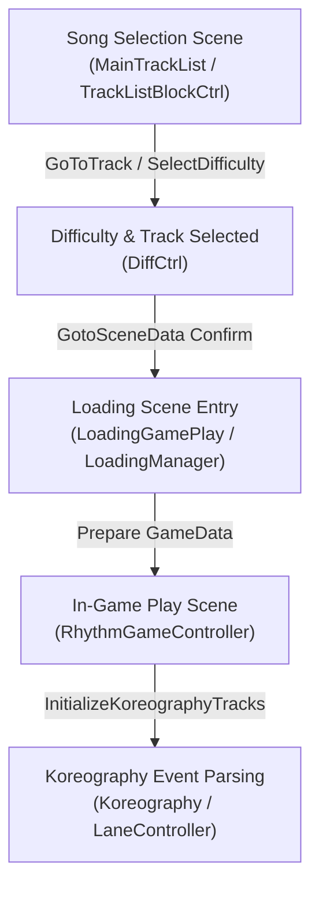
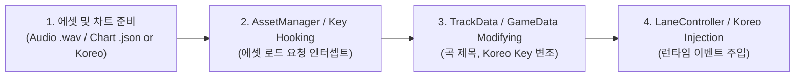

# DEFLATE Custom Chart Foundation Guide
> **DEFLATE 게임 (dizzylab) MelonLoader Il2Cpp 기반 커스텀 차트 개발 & 내부 아키텍처 기초 문서**  
> **작성자:** 화영왕 (Hwa-young-wang) | **버전:** v2.0.0

---

## 1. 개요 (Overview)

본 문서는 Unity 및 SonicBloom Koreography 엔진 기반으로 제작된 rhythm game **DEFLATE** (`dizzylab.castor`)의 내부 데이터 구조와 런타임 파이프라인을 분석하고, **MelonLoader (Il2Cpp)** 및 **Harmony Patching**을 활용하여 커스텀 차트(Custom Chart), 오디오(BGM), BGA(Video)를 인터셉트 및 주입하기 위한 기초 가이드입니다.

Mod의 핵심 목표는 다음 세 가지입니다:
1. **곡 및 차트 메타데이터 탐색/로그화:** 게임 내 등록된 전체 트랙 카탈로그 및 차트 key 스캔
2. **런타임 오디오/비디오 에셋 인터셉트:** Addressable 에셋 로딩 과정 모니터링 및 커스텀 에셋 교체 포인트 확보
3. **Koreography 및 노트(Lane) 이벤트 통제:** 런타임 차트 데이터 파싱 및 노트 생성 로직 제어

---

## 2. 내부 데이터 아키텍처 & 파이프라인

### 2.1 곡 메타데이터 구조 (`MainTrackList` & `TrackData`)
DEFLATE는 `MainTrackList` 컴포넌트 내에 전체 곡 데이터 배열 (`TrackData[] tracks`)을 관리합니다.

| 필드 / 프로퍼티 | 타입 | 설명 |
| :--- | :--- | :--- |
| `uniqueID` | `string` / `int` | 곡의 고유 식별자 ID |
| `TrackTitle` | `string` | 곡 제목 |
| `TrackAuthor` | `string` | 곡 아티스트 / 작곡가 |
| `TrackAlbum` | `string` | 앨범명 |
| `DiscID` | `int` | 디스크 번호 |
| `TrackCover` | `Sprite` | 곡 커버 / 자켓 이미지 스프라이트 (`sprite.name`, `texture`) |
| `audioClip_Key` | `string` | BGM 오디오 에셋 키 (Addressables Key) |
| `videoClip_Key` | `string` | BGA 비디오 에셋 키 (Addressables Key) |
| `EZ_TrackKore_Key` | `string` | Easy 난이도 Koreography 차트 키 |
| `NM_TrackKore_Key` | `string` | Normal 난이도 Koreography 차트 키 |
| `HD_TrackKore_Key` | `string` | Hard 난이도 Koreography 차트 키 |
| `EZ_Star` / `NM_Star` / `HD_Star` | `int` | 각 난이도 난이도 표기 (표기 별 개수) |

---

### 2.2 씬 전환 파이프라인 (Scene Transition Pipeline)



1. **곡 선택 씬 (`MainTrackList`)**:
   - `GoToTrack(index)`: 사용자가 커서를 이동할 때 트랙 선택 변경
   - `TrackListBlockCtrl.SetSelected(true)` / `OnPointerClick`: 트랙 UI 블록 선택
   - `DiffCtrl.SelectNextDifficulty()`: 난이도(EZ/NM/HD) 변경
   - `GotoSceneData()`: 곡 플레이 최종 확정
2. **로딩 씬 (`LoadingGamePlay` / `LoadingManager`)**:
   - `LoadingGamePlay.Start()`: 확정된 `gameData` (`NowTrackID`, `NowTrackTitle`, `targetKorePath`, `audioClip_Key`, `pv_Key`) 전달받아 씬 및 에셋 준비
3. **인게임 씬 (`RhythmGameController`)**:
   - `Start()`: 게임 컨트롤러 초기화
   - `InitializeKoreographyTracks()`: Koreography 객체 수신 및 트랙/이벤트 파싱
   - `TriggerAudioStartIfReady()`: BGM 오디오 재생 시작
   - `LoadVideo()` / `PlayVideoWithOffset()`: BGA 영상 로드 및 딜레이 오프셋 동기화 재생

---

### 2.3 Koreography 차트 데이터 구조 (SonicBloom Koreography)

DEFLATE는 Unity 전용 리듬게임 미들웨어인 **SonicBloom Koreography**를 사용합니다.

- **`Koreography`**: 차트의 최상위 클래스
  - `SampleRate`: 오디오 샘플 레이트 (예: `44100` Hz)
  - `Tracks`: `List<KoreographyTrack>` (각 트랙은 레인 또는 특정 이벤트 채널 담당) — **로드된 원본 차트 데이터**이며, 런타임에 `LaneController.laneEvents`를 아무리 비우거나 갈아끼워도 이쪽은 그대로 유지된다(실측 확인됨).
  - ⚠️ 주의: "`laneEvents`가 진짜 노트 데이터니까 거기만 건드리면 된다"는 식으로 **프로퍼티 자체를 정답으로 오해하기 쉽다.** 실제 핵심은 프로퍼티가 아니라 **타이밍**이다 — 자세한 내용은 4.4.1 참고.
- **`KoreographyTrack`**:
  - `EventID`: 트랙 식별자
  - `mEventList`: `List<KoreographyEvent>`
- **`KoreographyEvent`**:
  - `StartSample`: 노트 시작 오디오 샘플 타임스탬프 (`int`)
  - `EndSample`: 노트 종료 오디오 샘플 타임스탬프 (롱노트/Hold 처리 시 사용)
  - 파라미터 없는 public 생성자(`new KoreographyEvent()`)가 있어 런타임에 직접 생성 가능. `StartSample`/`EndSample`은 `set` 가능.

> ✅ **실측 확인된 트랙 구성 (곡 `074_ez` 기준, 총 10트랙)**
>
> | EventID | 담당 레인 (`RhythmGameController` 필드) | 노트 수(예시) |
> | :--- | :--- | :--- |
> | `hihat_1` ~ `hihat_4` | `lane_hihat_1` ~ `lane_hihat_4` | 86 / 102 / 94 / 76 |
> | `kick_left` / `kick_right` | `lane_kick_left` / `lane_kick_right` | 83 / 84 |
> | `snare_left` / `snare_right` | `lane_snare_left` / `lane_snare_right` | 41 / 50 |
> | `drop` | `lane_drop` | 6 |
> | `beat` | `linebar` (`LineBarController`, `LaneController`와 별개 타입) | 524 |
>
> `EventID` 문자열이 위 9개(±`beat`)와 정확히 일치해야 게임이 해당 레인에 노트를 스폰한다. `beat`는 `LineBarController`가 처리하므로 `LaneController` 기준 훅으로는 잡히지 않는다.

---

## 3. 핵심 시간 계산 및 차트 파싱 공식

### 3.1 Sample - 시간(초) 변환 공식
Koreography의 타임스탬프는 **Audio Sample** 단위로 저장됩니다.

$$\text{Time (seconds)} = \frac{\text{StartSample}}{\text{SampleRate}}$$

$$\text{StartSample} = \text{Time (seconds)} \times \text{SampleRate}$$

---

### 3.2 BMS / Tick 기반 시간 공식 연동
BMS 또는 표준 MIDI/Tick 기반 커스텀 차트를 Koreography 이벤트로 변환할 때 사용되는 기본 시간 계산 공식입니다:

$$\text{Time (seconds)} = \frac{\text{tick} \times 240}{\text{bpm} \times \text{resolution}}$$

*(기본 resolution = 480 또는 960 tick per beat 기준이며, 4/4 박자 1마디 = 1920 ticks일 경우)*

오디오 샘플 연동 변환 공식:
$$\text{StartSample} = \left( \frac{\text{tick} \times 240}{\text{bpm} \times \text{resolution}} \right) \times \text{SampleRate}$$

---

## 4. 모드 아키텍처 및 훅 지점 (Hooking Points)

본 레포지토리 모드(`DEFLATE_custom_chart`)는 다음과 같은 훅 클래스들로 모듈화되어 구성되어 있습니다:

### 4.1 `SongListHooks.cs` (곡 목록 및 패널 모니터링)
- `MainTrackList.Start` (Postfix): 수록된 모든 트랙 카탈로그 정보를 스캔하여 제목, 아티스트, 각 에셋 Key 로그 출력.
- `MainTrackList.GoToTrack` / `TrackListBlockCtrl.SetSelected`: 곡 탐색 커서 모니터링.
- `MainTrackList.GotoSceneData` (Prefix): 플레이 버튼 클릭 시 최종 결정된 곡 ID 로그 확인.

### 4.2 `LoadingSceneHooks.cs` (로딩 및 씬 전환)
- `LoadingGamePlay.Start` (Postfix): 플레이 시작 전 `gameData` 검증. Target Koreo, Audio Key, PV Key 확인.
- `LoadingManager.LoadScene` (Prefix): 전환되는 씬 이름 인터셉트.

### 4.3 `AssetManagerHooks.cs` (에셋 관리자 인터셉터)
- `TrackAssetManager.LoadAudioClip` (Prefix): BGM 클립 로드 요청 key 인터셉트.
- `TrackAssetManager.LoadVideoClip` / `LoadVideoURL` (Prefix): BGA 비디오 클립 로드 요청 key 인터셉트.
- `Bank_PV_Ctrl.PlayPVVideo` / `LoadVideoAndAudio`: PV 메뉴 에셋 로딩 모니터링.

### 4.4 `InGameRhythmHooks.cs` (인게임 리듬 게임 제어)
- `RhythmGameController.Start`: 인게임 진입 확인 및 Auto Mode, Note Speed, Track ID 출력.
- `RhythmGameController.InitializeKoreographyTracks` (Postfix): `playingKoreo`에 접근하여 트랙 수/총 노트 수 로그 출력.
  > ⚠️ **실측 확인:** 이 메서드의 **Prefix 시점에는 `__instance.playingKoreo`가 아직 `null`**이다. `playingKoreo`는 `InitializeKoreographyTracks` 메서드 내부에서 세팅되므로, Prefix에서 `playingKoreo`를 읽거나 트랙을 미리 조작하려는 시도는 전부 조용히 실패한다(예외 없이 null 체크에 걸려 리턴됨). 노트 데이터를 만지려면 4.4.1의 `LoadKoreographyEvents`를 노려야 한다.
- `RhythmGameController.UpdateSongDurationScrollbar`: 진행률 스크롤바 갱신 모니터링.
- `RhythmGameController.LoadVideo` / `PlayVideoWithOffset`: BGA 비디오 플레이어 지정 URL 및 Offset 제어.

#### 4.4.1 `RhythmGameController.LoadKoreographyEvents` — ✅ 실전 검증된 노트 주입 "타이밍"

> ❗ **정정:** 처음엔 "`LaneController.laneEvents`가 실제 플레이되는 노트 리스트니까 그 프로퍼티 자체가 조작 지점"이라고 정리했는데, 이건 절반만 맞는 얘기다. `laneEvents`는 게임 곳곳(`Update`, `CheckSpawnNext`, `pendingEventIdx` 진행 등)에서 계속 읽고 쓰이는 **살아있는 런타임 상태**라서, 아무 시점에나 건드린다고 되는 게 아니다. 진짜 핵심은 **"언제 건드리느냐"**다 — `koreo.Tracks[].mEventList`(원본, 항상 유효)가 `laneEvents`(런타임 사본)로 **옮겨지는 그 순간**을 정확히 잡아야 하고, 그 순간이 바로 아래 `LoadKoreographyEvents`다. 프로퍼티 이름이 아니라 **호출 타이밍**을 찾은 게 이번에 검증된 내용이다.

`InitializeKoreographyTracks` 내부에서 `playingKoreo`가 세팅된 직후, **트랙(EventID)마다 한 번씩** 비공개 메서드 `LoadKoreographyEvents(string trackID, LaneController lane)`가 호출되어 `koreo.Tracks[].mEventList`의 내용을 각 `LaneController.laneEvents`로 실제로 옮겨 담는다. 이 메서드의 **Postfix가 발동하는 그 순간**이 게임 전체를 통틀어 **"차트 데이터 → 실제 플레이될 노트 리스트"로 전환되는 유일한 타이밍**이며, 다음이 실측으로 확인됐다:

- Postfix에서 `lane.laneEvents`를 비우면(`Clear()`) 그 레인은 노트 없이 정상 플레이된다 (크래시/예외 없음, BGM·BGA·판정 로직 전부 정상 동작).
- `koreo.Tracks[].mEventList`(원본)는 이 시점에도 항상 온전하므로, 여기서 원본 데이터를 참고해 원하는 노트만 골라 `lane.laneEvents`에 다시 채워 넣으면 된다.
- `laneEvents`는 이 코드베이스의 디컴파일 헤더 기준 순수 `System.Collections.Generic.List<KoreographyEvent>`로 노출되어 있어 `Clear()` / `Add()`가 그대로 동작한다.
- `beat`(라인바) 트랙은 `LaneController`가 아닌 `LineBarController`가 처리하므로 이 훅으로는 안 잡힌다. `activeLineBars`는 별개로 계속 표시됨.

```csharp
// 검증됨: DEFLATE custom chart/Hooks/InGameRhythmHooks.cs
[HarmonyPatch(typeof(RhythmGameController), nameof(RhythmGameController.LoadKoreographyEvents))]
public static class RhythmGameController_LoadKoreographyEvents_Patch
{
    public static void Postfix(RhythmGameController __instance, string trackID, LaneController lane)
    {
        if (lane == null) return;
        if (__instance == null || __instance.playingKoreo == null || __instance.playingKoreo.Tracks == null)
        {
            lane.laneEvents?.Clear();
            return;
        }

        var koreo = __instance.playingKoreo;

        // 예: 곡 전체(9개 게임플레이 레인)에서 StartSample > 0인 가장 빠른 노트를 찾아
        // 그 레인에만 5초 간격 3연발로 다시 채워 넣고, 나머지 레인은 비운다.
        string globalFirstTrackID = null;
        int globalFirstStart = int.MaxValue, globalFirstEnd = 0;

        foreach (var trk in koreo.Tracks)
        {
            if (trk == null || trk.EventID == "beat" || trk.mEventList == null) continue;
            foreach (var ev in trk.mEventList)
            {
                if (ev != null && ev.StartSample > 0 && ev.StartSample < globalFirstStart)
                {
                    globalFirstStart = ev.StartSample;
                    globalFirstEnd = ev.EndSample;
                    globalFirstTrackID = trk.EventID;
                }
            }
        }

        lane.laneEvents?.Clear();
        if (trackID == globalFirstTrackID && globalFirstTrackID != null)
        {
            int duration = globalFirstEnd - globalFirstStart;
            int intervalSamples = koreo.SampleRate * 5; // 5초 간격
    }
}
```

#### 4.4.2 롱노트(Hold Note / Long Note) 런타임 생성 원리 및 검증 — ✅ 실전 검증 완료

Koreography 엔진 기반의 DEFLATE에서 일반 단타(숏노트)와 롱노트(Hold Note)를 구분하는 핵심 프로퍼티는 `KoreographyEvent`의 **`StartSample`과 `EndSample` 오디오 샘플 차이(`Duration = EndSample - StartSample`)**입니다.

- **단타 노트 (Short Note):** `EndSample == StartSample` 이거나 지속 시간 오프셋이 매우 작음.
- **롱노트 (Hold Note):** `EndSample - StartSample >= TargetDurationInSamples`
  - 오디오 샘플 레이트가 `SampleRate = 44,100Hz` 일 때 **1.5초 지속되는 롱노트**를 생성하려면 `longNoteDuration = (int)(koreo.SampleRate * 1.5f)` = `66,150` 샘플을 지정합니다.
  - 즉, `new KoreographyEvent { StartSample = start, EndSample = start + longNoteDuration }` 형태로 생성하여 `lane.laneEvents`에 추가하면, 런타임 `LaneController` 및 `NoteObject`가 이를 자동으로 인식하여 롱노트 렌더링(Hold Visual Ribbon) 및 롱노트 홀드 판정 로직을 실행합니다.

```csharp
// 실전 검증 완료: 특정 레인(예: hihat_3)에 1.5초 롱노트 3연발 런타임 주입
bool isTargetLane = string.Equals(trackID, "hihat_3", StringComparison.OrdinalIgnoreCase)
    || string.Equals(lane.laneType.ToString(), "HiHat_3", StringComparison.OrdinalIgnoreCase);

if (isTargetLane && globalFirstStart != int.MaxValue)
{
    int longNoteDuration = (int)(koreo.SampleRate * 1.5f); // 1.5초 길이 롱노트
    int intervalSamples = koreo.SampleRate * 5;             // 5초 간격

    lane.laneEvents?.Clear();
    for (int copy = 0; copy < 3; copy++)
    {
        int start = globalFirstStart + intervalSamples * copy;
        lane.laneEvents.Add(new KoreographyEvent
        {
            StartSample = start,
            EndSample = start + longNoteDuration
        });
    }
}
else
{
    lane.laneEvents?.Clear();
}
```

### 4.5 `NoteHooks.cs`
- `RhythmGameController.RecalculateAllNoteCount`: 총 노트 수 재계산 시점 추적.

> `LaneController.AddEventToLane(KoreographyEvent evt)`도 존재하지만 **개별 노트 하나씩** 받는 시그니처라 노트 여러 개를 넣으려면 반복 호출이 필요하다. 차트 전체를 한 번에 갈아끼우는 용도로는 4.4.1의 `LoadKoreographyEvents` 쪽이 더 적합하다(검증 완료). `AddEventToLane`은 실시간으로 노트 하나를 즉석 추가하고 싶을 때 정도만 고려.

---

## 5. 커스텀 차트 & 에셋 주입 단계별 가이드 (Custom Injection Workflow)

DEFLATE에 완전히 새로운 커스텀 곡과 차트를 주입하는 단계별 가이드입니다.



### 5.1 곡 선택 트랙 런타임 복제 & 생성 (Track Instantiation & Expansion)
DEFLATE의 곡 메타데이터 컴포넌트는 `MainTrackListBlock`이며, `MainTrackList` 내의 `tracks` (`Il2CppReferenceArray<MainTrackListBlock>`) 배열로 통제됩니다.

**복제 기법 (Instantiate & Array Injection):**
1. 기존의 `MainTrackListBlock.gameObject`를 `UnityEngine.Object.Instantiate`로 런타임 복제
2. 복제된 `MainTrackListBlock`의 프로퍼티 (`uniqueID`, `TrackTitle`, `TrackAuthor`, `audioClip_Key`, `EZ_TrackKore_Key` 등)를 커스텀 값으로 변조
3. `MainTrackList.tracks` 참조 배열을 `Il2CppReferenceArray<MainTrackListBlock>(oldLen + 1)` 형태로 확장하여 런타임 곡 추가

```csharp
[HarmonyPatch(typeof(MainTrackList), nameof(MainTrackList.Start))]
public static class MainTrackList_Start_Patch
{
    public static void Prefix(MainTrackList __instance)
    {
        var originalBlock = __instance.tracks[0];
        var clonedGo = UnityEngine.Object.Instantiate(originalBlock.gameObject, __instance.transform);
        var clonedBlock = clonedGo.GetComponent<MainTrackListBlock>();

        clonedBlock.uniqueID = "custom_cloned_track_999";
        clonedBlock.TrackTitle = "[CUSTOM] 복제된 커스텀 곡";
        clonedBlock.TrackAuthor = "화영왕 (Hwa-young-wang)";

        // tracks 배열 N -> N+1 확장 주입
        var oldTracks = __instance.tracks;
        var newTracks = new Il2CppReferenceArray<MainTrackListBlock>(oldTracks.Length + 1);
        for (int i = 0; i < oldTracks.Length; i++) newTracks[i] = oldTracks[i];
        newTracks[oldTracks.Length] = clonedBlock;
        __instance.tracks = newTracks;
    }
}
```

### 단계 1: 커스텀 에셋 준비
- **오디오:** WAV / OGG 파일 (SampleRate: 44100Hz 또는 48000Hz 권장)
- **차트:** BMS / JSON 형태의 타임스탬프 데이터를 `KoreographyEvent` 배열로 변환

### 단계 2: 에셋 Key 인터셉트
`TrackAssetManager.LoadAudioClip`의 Prefix 훅에서 `ref string key` 값을 감지하여 타겟 곡의 Key일 경우 로컬 커스텀 `AudioClip`을 반환하거나 키를 리다이렉트합니다.

### 단계 3: 곡 메타데이터 변조
`MainTrackList.Start` Postfix에서 `tracks` 배열 내 특정 곡의 `TrackTitle`, `TrackAuthor`, `EZ_TrackKore_Key` 등을 커스텀 데이터로 수정합니다.

### 단계 4: 노트 이벤트 런타임 주입 (검증됨)
`RhythmGameController.LoadKoreographyEvents(trackID, lane)` 훅(Postfix)에서 `trackID`에 맞는 커스텀 `KoreographyEvent` 목록을 `new KoreographyEvent { StartSample = ..., EndSample = ... }`로 생성해 `lane.laneEvents`에 채워 넣습니다. (4.4.1 참고 — `InitializeKoreographyTracks` Prefix에서는 `playingKoreo`가 아직 null이라 이 방식은 동작하지 않음.)

---

## 5.5 ⚠️ IL2CPP 모딩할 때 헷갈리는 지점들 (실전에서 실제로 삽질한 것들)

이 게임(Il2CppInterop + MelonLoader) 모딩은 일반 C# 리버싱보다 훨씬 헷갈린다. 아래는 이번 작업에서 실제로 시간을 잡아먹었던 함정들이다.

1. **디컴파일 헤더엔 바디가 없다.** `Decompiled/` 폴더의 `.cs` 파일들은 필드/프로퍼티/메서드 **시그니처만** 있고 실제 로직(네이티브 IL2CPP 코드)은 안 보인다. "이 메서드가 무슨 일을 하는지"는 코드를 읽어서 알 수 없고, **직접 로그를 찍어서 실행 순서와 상태를 실측해야만** 확인된다. 이번에 `playingKoreo`가 `InitializeKoreographyTracks` Prefix 시점엔 null이라는 것도 코드 리딩으로는 절대 못 알아냈고, 로그 찍어보고서야 알았다.

2. **비슷하게 생긴 리스트가 3개나 있고, 서로 다른 레이어다.** 헷갈리기 딱 좋다:
   - `KoreographyTrack.mEventList` — 차트 **원본 데이터**. 뭘 하든 안 건드리는 한 항상 그대로.
   - `LaneController.laneEvents` — 그 원본에서 복사된 **런타임 노트 큐**. `LoadKoreographyEvents` 시점에 채워지고, 게임이 진행되며 `pendingEventIdx`로 소비됨.
   - `RhythmGameController.activeNotes` — 그마저도 아니고, **실제로 화면에 스폰된 노트 오브젝트(GameObject)** 리스트. 노트 데이터가 아니라 비주얼.
   
   셋 다 "노트 리스트"라고 부를 수 있어서 이름만 보고 아무거나 건드리면 원하는 효과가 안 난다.

3. **Prefix에서 null인 게 버그가 아니라 정상일 수 있다.** `InitializeKoreographyTracks`처럼, 훅 대상 메서드가 "그 값을 세팅하는 당사자"인 경우 Prefix 시점엔 아직 없는 게 당연하다. 이럴 때 흔한 실수는 null 체크에 걸려 **조용히 리턴**하는 코드를 짜놓고 "왜 로그가 안 찍히지?"를 반나절 고민하는 것 — 초반엔 무조건 모든 분기에 로그를 남겨서 "어디서 멈췄는지"부터 확인하는 게 빠르다.

4. **빌드가 성공해도 게임에 실제로 반영됐는지는 별개 문제다.** MelonLoader Mods 폴더에 파일을 복사했다고 끝이 아니다. 게임이 이미 켜져 있으면 새 dll을 읽지 않고, 로그 파일도 여러 개(`Logs/타임스탬프.log`, `Latest.log`)가 쌓여서 옛날 로그를 보고 착각하기 쉽다. **`Get-FileHash`로 배포된 dll과 빌드 산출물의 SHA256을 대조**하고, MelonLoader 로그의 `SHA256 Hash:` 줄과도 맞춰보는 습관이 디버깅 시간을 크게 줄여준다.

5. **훅 하나 잘못 걸면 예외 없이 그냥 아무 일도 안 일어난다.** Harmony 패치가 실패해도, 조건문에서 조용히 return해도 게임은 멀쩡히 돌아간다. "크래시가 안 났으니 됐다"가 아니라 "의도한 로그 줄이 실제로 찍혔는지"까지 확인해야 진짜 검증이다.

---

## 6. 결론 및 향후 모딩 방향

본 기초 문서는 DEFLATE 모드의 현재 구조(v2.0.0)를 바탕으로 작성되었습니다.
- **다음 단계:** Addressables 에셋 번들 자체 교체 방식 대신 런타임 메모리 주입(Memory Injection) 방식을 안정화하여, 게임 에셋 훼손 없이 완벽한 오프라인 커스텀 차트 플레이 환경을 구성할 수 있습니다.
