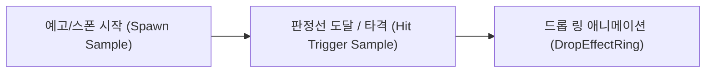

# DEFLATE 드롭(Drop) 노트 시스템 분석 및 모딩 가이드

> [!NOTE]
> 본 문서는 **DEFLATE** 게임 내부의 드롭(Drop) 심벌 노트 구조, 2중 샘플 타이밍 메커니즘, 그리고 모딩 시 노트 주입 및 잔여 노트 소탕(Purge) 방법에 관한 기술 문서입니다.

---

## 1. 드롭(Drop) 노트 개요

DEFLATE의 드롭 노트는 일반 드럼 레인(`kick`, `snare`, `hihat`) 노트와 달리, 독립된 렌더러와 2단계 오프셋 타이밍(2중 샘플)을 사용하는 특수 노정 시스템입니다.


```mermaid
flowchart LR
    A["예고/스폰 시작 (Spawn Sample)"] --> B["판정선 도달 / 타격 (Hit Trigger Sample)"]
    B --> C["드롭 링 애니메이션 (DropEffectRing)"]
```

---

## 2. 2중 샘플 구조 및 필드 분석

드롭 노트는 레인 컨트롤러(`LaneController`)에 종속되지 않고, `RhythmGameController` 레벨에서 관리됩니다.

### 🔑 주요 필드 (RhythmGameController)

| 필드명 | 데이터 타입 | 설명 |
| :--- | :--- | :--- |
| `dropEventSamples` | `List<int>` / `Il2CppSystem.Collections.Generic.List<int>` | 각 드롭 노트의 **타격/트리거 샘플 시점** 목록 |
| `processedDropSamples` | `HashSet<int>` / `Il2CppSystem.Collections.Generic.HashSet<int>` | 이미 판정이 완료되었거나 처리된 드롭 샘플 시점 추적 해시셋 |
| `nextDropEventIdx` | `int` | 다음에 도달할 드롭 노트의 배열 인덱스 포인터 |
| `dropRightTirggle` | `bool` | 드롭 심벌이 좌측 / 우측 중 어느 방향에서 떨어지는지 결정하는 토글 |
| `dropSpriteToggle` | `bool` | 드롭 노트 스프라이트 렌더링 토글 상태 |
| `DropNoteComming` | `bool` | 현재 드롭 노트가 접근 중인지 여부 (UI 경고 표시용) |
| `isPlayingDropEffect` | `bool` | 드롭 타격 시 기본 붐 효과음/이펙트 재생 여부 |
| `isPlayingDropEffectRing` | `bool` | 드롭 링 파형 이펙트 애니메이션 재생 상태 |

> [!IMPORTANT]
> **왜 2중 샘플인가?**  
> 일반 단노트는 단일 `StartSample`로 표현되지만, 드롭 노트는 **화면 상단 낙하 시작 샘플**과 **실제 노드가 판정선에 닿아 드럼을 타격하는 샘플** 간의 샘플 폭(Offset)이 동적으로 계산되어 작동합니다.

---

## 3. 커스텀 차트 주입 시 주의사항

1. **독립 배열 분리 문제**
   * 일반 레인(`lane.laneEvents.Clear()`)만 비울 경우, `dropEventSamples`에 남아있는 샘플로 인해 공중에 드롭 심벌 노드가 출현하거나 판정 윈도우에 개입할 수 있습니다.
2. **MISMATCH 판정 유발**
   * 드롭 노트 샘플이 `dropEventSamples`에 등록된 상태에서 사용자가 다른 키(스네어/킥)를 누를 경우, `MISMATCH` (키 불일치) 판정이 연출됩니다.

---

## 4. 커스텀 차트 주입 & 잔여 노트 소탕(Purge) 가이드

커스텀 차트를 주입할 때 기존 원본 곡의 드롭 노트를 소탕하고 BMS 드롭 노트로 바꾸는 패치입니다 (`InGameRhythmHooks.cs`의 실제 코드 요약). 레인 노트는 그보다 먼저 `LoadKoreographyEvents` Postfix에서 교체되고, 이 Postfix는 `InitializeKoreographyTracks`가 끝난 뒤에 실행됩니다.

```csharp
[HarmonyPatch(typeof(RhythmGameController), "InitializeKoreographyTracks")]
public static class RhythmGameController_InitializeKoreographyTracks_Patch
{
    public static void Postfix(RhythmGameController __instance)
    {
        if (__instance == null || __instance.playingKoreo == null) return;
        var koreo = __instance.playingKoreo;

        if (HwaAssetManager.IsTargetTrackActive)
        {
            // 1. 드롭 심벌 전용 독립 배열 초기화
            if (__instance.dropEventSamples != null) __instance.dropEventSamples.Clear();
            if (__instance.processedDropSamples != null) __instance.processedDropSamples.Clear();
            __instance.nextDropEventIdx = 0;

            // 2. BMS 14번 채널(드롭 레인) 노트를 dropEventSamples에 다시 채움
            var bmsChart = HwaAssetManager.LoadedBmsChart;
            if (bmsChart != null && bmsChart.Notes.Count > 0 && __instance.dropEventSamples != null)
            {
                foreach (var n in bmsChart.Notes)
                {
                    if (BmsLaneMapper.ResolveNoteLane(n) == BmsLaneMapper.Drop)
                        __instance.dropEventSamples.Add(n.SamplePosition);
                }
            }

            // 3. BMS가 없는 곡만: 원본 Koreography 트랙 중 hihat_3 외 이벤트를 비움
            //    (원본 에셋의 mEventList를 직접 수정하므로 BMS 곡에서는 하지 않는다)
            if (koreo.Tracks != null && bmsChart == null)
            {
                for (int i = 0; i < koreo.Tracks.Count; i++)
                {
                    var trk = koreo.Tracks[i];
                    if (trk == null || trk.mEventList == null) continue;
                    if (!string.Equals(trk.EventID, "hihat_3", StringComparison.OrdinalIgnoreCase))
                    {
                        trk.mEventList.Clear();
                    }
                }
            }
        }
    }
}
```

---

> [!TIP]
> **BMS 파서와 드롭 노트 연동 시 채널 매핑**  
> 드롭 노트는 **`14`번 채널 전용**입니다 (규격: [`bms_mapping_spec.md`](bms_mapping_spec.md)). `14`번에 찍힌 노트는 `lane_drop` 레인에 주입되는 동시에 `dropEventSamples` 배열에도 등록되어, 원본의 드롭 심벌 연출이 커스텀 차트에서도 그대로 재현됩니다.
